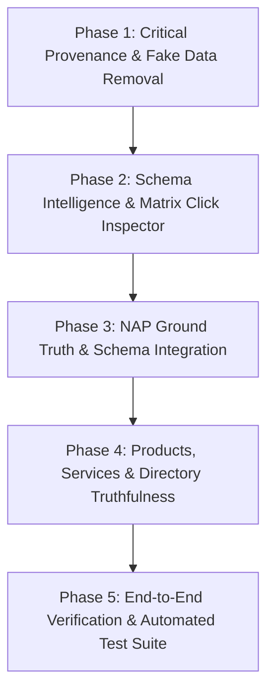

# LOCALLIFT — LOCAL SEO MODULES REMEDIATION & IMPLEMENTATION PLAN

**Date:** 2026-09-25  
**Based on:** [`LOCALLIFT_LOCAL_SEO_FORENSIC_AUDIT.md`](file:///c:/Users/Jiniyas%20Suthar/OneDrive/Desktop/LocalLift/LOCALLIFT_LOCAL_SEO_FORENSIC_AUDIT.md)

---

## 1. REMEDIATION ROADMAP OVERVIEW

This plan organizes the findings from the deep forensic audit into an ordered, non-breaking remediation sequence. Every finding is assigned acceptance criteria, affected files, and test verification requirements.

---

## 2. PHASE 1: CRITICAL PROVENANCE & FAKE DATA REMOVAL (P0)

### Task 1.1: Remove Auto-Seeding of Fake Directory Citations
- **Issue:** `_seed_citations_if_empty` creates 10 entries with generic root URLs (`https://www.google.com`) marked as `"approved"` and `"VERIFIED"`.
- **Target Files:** [`backend/app/api/v1/local_seo.py`](file:///c:/Users/Jiniyas%20Suthar/OneDrive/Desktop/LocalLift/backend/app/api/v1/local_seo.py)
- **Changes:**
  1. Remove `_seed_citations_if_empty` calls from `list_citations` and `get_citation_distribution`.
  2. Return clean empty state if no citations have been discovered or manually entered.
  3. Update `CitationsView.tsx` empty state to offer real discovery or manual citation addition.
- **Acceptance Criteria:** A fresh project with 0 citations shows 0 listings and does not fabricate Google/Apple/Yelp records.

### Task 1.2: Remove Fabricated "CONNECTED" Google Profile on Catalog Creation
- **Issue:** Adding a product/service on a disconnected project creates a `GoogleBusinessProfile` with `status="CONNECTED"`.
- **Target Files:** [`backend/app/api/v1/gbp.py`](file:///c:/Users/Jiniyas%20Suthar/OneDrive/Desktop/LocalLift/backend/app/api/v1/gbp.py)
- **Changes:**
  1. In `_get_or_create_gbp_profile`, set `status="UNCONNECTED"` or `"LOCAL_ONLY"` when no Google account is bound.
  2. Tag items created by users with `"source": "MANUAL_ENTRY"` instead of `"GOOGLE_BUSINESS_PROFILE"`.
- **Acceptance Criteria:** Disconnected projects correctly show disconnected badge while allowing local catalog management.

### Task 1.3: Fix False NAP Consistency Calculation
- **Issue:** Missing/null fields are counted as `"consistent"` because `c.nap_status == "consistent"` was hardcoded.
- **Target Files:** [`backend/app/services/local_seo/nap_service.py`](file:///c:/Users/Jiniyas%20Suthar/OneDrive/Desktop/LocalLift/backend/app/services/local_seo/nap_service.py)
- **Changes:**
  1. Only mark a source consistent if observed fields match canonical ground truth with verified evidence.
  2. Require at least one verified external field before scoring a source as consistent.
- **Acceptance Criteria:** Empty citation entries show as unverified/missing rather than 100% consistent.

---

## 3. PHASE 2: SCHEMA INTELLIGENCE & MATRIX CLICK INSPECTOR (P0 / P1)

### Task 2.1: Implement Tier 1 Schema Matrix Detail Modal & Click Handlers
- **Issue:** Matrix cards in `SchemaGeneratorView.tsx` are static `
`s with no click interaction.
- **Target Files:** [`frontend/src/views/SchemaGeneratorView.tsx`](file:///c:/Users/Jiniyas%20Suthar/OneDrive/Desktop/LocalLift/frontend/src/views/SchemaGeneratorView.tsx)
- **Changes:**
  1. Add `selectedMatrixSchema` state and `onClick` handler on each of the 18 Tier 1 cards.
  2. Implement an entity detail drawer/modal that displays:
     - Entity name, detected status (Detected, Missing, Invalid, Not Applicable), and applicability rationale.
     - Detected properties and page URL where found.
     - Validation warnings and missing recommended properties.
     - "Open in Generator" button that switches to the Generator tab with the selected schema type and prefilled business data.
- **Acceptance Criteria:** Clicking any matrix card opens the detail modal with accurate live data.

### Task 2.2: Dynamic Page-by-Page Schema Applicability & Error Aggregation
- **Issue:** Project-level summary hardcodes `has_reviews=True, has_faq=True, page_type="Homepage"` and does flawed error checking.
- **Target Files:** [`backend/app/api/v1/local_seo.py`](file:///c:/Users/Jiniyas%20Suthar/OneDrive/Desktop/LocalLift/backend/app/api/v1/local_seo.py), [`backend/app/services/schema_intelligence.py`](file:///c:/Users/Jiniyas%20Suthar/OneDrive/Desktop/LocalLift/backend/app/services/schema_intelligence.py)
- **Changes:**
  1. Aggregate applicability across all crawled pages rather than evaluating only a dummy homepage.
  2. Match validation errors by checking entity validation dictionaries on each `SchemaRecord`.
- **Acceptance Criteria:** `FAQPage` and `AggregateRating` only show as Missing when pages actually contain FAQ or review content.

---

## 4. PHASE 3: NAP GROUND TRUTH & WEBSITE SCHEMA INTEGRATION (P1 / P2)

### Task 3.1: Include Website Schema Records in NAP Comparison
- **Issue:** `schema_records` are retrieved in `nap_service.py` but never included in the comparison output.
- **Target Files:** [`backend/app/services/local_seo/nap_service.py`](file:///c:/Users/Jiniyas%20Suthar/OneDrive/Desktop/LocalLift/backend/app/services/local_seo/nap_service.py)
- **Changes:**
  1. Parse structured NAP data from `SchemaRecord` entities (`LocalBusiness`, `Organization`).
  2. Append a `"WEBSITE_SCHEMA"` source into the NAP comparison table with exact expected vs. found values.
- **Acceptance Criteria:** The NAP Consistency view shows the Website Structured Data row with its evaluated phone, address, and name.

### Task 3.2: Enhanced NAP Phone and Address Normalization
- **Issue:** Strict string matching fails on minor formatting discrepancies (e.g. `(07)` vs `+61 7`, `Street` vs `St`).
- **Target Files:** [`backend/app/services/local_seo/nap_service.py`](file:///c:/Users/Jiniyas%20Suthar/OneDrive/Desktop/LocalLift/backend/app/services/local_seo/nap_service.py), [`backend/app/services/google/nap_matcher.py`](file:///c:/Users/Jiniyas%20Suthar/OneDrive/Desktop/LocalLift/backend/app/services/google/nap_matcher.py)
- **Changes:**
  1. Use canonical international phone normalization (handling Australian `0`, US `1`, UK `0` trunk prefixes).
  2. Implement standard postal street suffix abbreviation mapping.
- **Acceptance Criteria:** `123 Main Street` matches `123 Main St.` as consistent.

---

## 5. PHASE 4: PRODUCTS, SERVICES & DIRECTORY TRUTHFULNESS (P1)

### Task 4.1: Clarify Directory Distribution vs Discovery Actions
- **Target Files:** [`frontend/src/views/CitationsView.tsx`](file:///c:/Users/Jiniyas%20Suthar/OneDrive/Desktop/LocalLift/frontend/src/views/CitationsView.tsx), [`backend/app/api/v1/local_seo.py`](file:///c:/Users/Jiniyas%20Suthar/OneDrive/Desktop/LocalLift/backend/app/api/v1/local_seo.py)
- **Changes:**
  1. Update `"Distribute All"` to `"Verify All Listings"` or clearly state directory checking vs. manual submission requirements.
  2. Provide direct claiming links for major directories when a business is missing or needs manual claiming.
- **Acceptance Criteria:** The user is clearly informed which directories require manual claiming and which are automatically discovered.

### Task 4.2: Explicit Item Provenance in Products & Services
- **Target Files:** [`frontend/src/views/ProductsServicesView.tsx`](file:///c:/Users/Jiniyas%20Suthar/OneDrive/Desktop/LocalLift/frontend/src/views/ProductsServicesView.tsx), [`backend/app/api/v1/gbp.py`](file:///c:/Users/Jiniyas%20Suthar/OneDrive/Desktop/LocalLift/backend/app/api/v1/gbp.py)
- **Changes:**
  1. Display source badges: `"Google Business Profile"`, `"Manual Entry"`, or `"Website Extracted"`.
  2. Preserve manual edits and prevent overwriting on sync.
- **Acceptance Criteria:** User can immediately tell which items are verified from Google vs created locally.

---

## 6. PHASE 5: TEST SUITE & VERIFICATION

### Acceptance Test Cases:
1. `test_schema_matrix_modal_data_integrity`: Verify that all 18 Tier 1 schemas provide valid detail responses and generator prefill.
2. `test_no_fake_citations_seeding`: Ensure fresh projects return empty arrays and no hardcoded 98-DA citations.
3. `test_nap_consistency_with_schema_source`: Verify website schema is included in the NAP comparison matrix.
4. `test_products_services_provenance_isolation`: Verify that manually created items have `source="MANUAL_ENTRY"` and do not fabricate a connected GBP profile.
